# ADOT Serverless Demo

This repository contains a greenfield AWS SAM application that demonstrates the same Lambda-based document pipeline with two explicit deployment configurations:

- `appsignals` uses CloudWatch Application Signals
- `otel` uses a third-party OpenTelemetry backend over OTLP

Both deployment configurations share:

- a public HTTP API in `nodejs22.x`
- an SQS-driven worker in `python3.13`
- an S3-triggered indexer in `python3.13`
- shared state in DynamoDB and generated artifacts in S3
- custom span events at the main demo milestones so individual traces are easier to inspect

## Relevant AWS Docs

- [Enable your applications on Lambda](https://docs.aws.amazon.com/AmazonCloudWatch/latest/monitoring/CloudWatch-Application-Signals-Enable-LambdaMain.html)
- [Monitor application performance with Amazon CloudWatch Application Signals](https://docs.aws.amazon.com/lambda/latest/dg/monitoring-application-signals.html)
- [AWS Distro for OpenTelemetry Lambda](https://aws-otel.github.io/docs/getting-started/lambda/)
- [AWS Distro for OpenTelemetry Lambda Support For Python](https://aws-otel.github.io/docs/getting-started/lambda/lambda-python/)
- [AWS Distro for OpenTelemetry Lambda Support For JavaScript](https://aws-otel.github.io/docs/getting-started/lambda/lambda-js/)
- [AWS::ApplicationSignals::Discovery](https://docs.aws.amazon.com/AWSCloudFormation/latest/TemplateReference/aws-resource-applicationsignals-discovery.html)

## Architecture

<div align="center">
<picture>
  <source media="(prefers-color-scheme: dark)" srcset="./svgs/readme-1-dark.svg">
  
</picture>
</div>

<details data-mermint-source="true">
  <summary>Mermaid source</summary>



</details>

```mermaid
---
config:
  theme: base
  look: handDrawn
  themeVariables:
    lineColor: "#7d8593"
  architecture:
    iconSize: 64
    padding: 48
    fontSize: 16
---
architecture-beta
  group edge(aws:aws-api-gateway)[HTTP API]
  service api(aws:aws-api-gateway)[Gateway] in edge

  group demo_api_group(aws:aws-lambda)[Demo API]
  service demo_api(aws:aws-lambda)[Lambda] in demo_api_group

  group state(aws:dynamodb)[State]
  service jobs(aws:dynamodb)[Jobs] in state
  service queue(aws:simple-queue-service)[Queue] in state
  service dlq(aws:simple-queue-service)[DLQ] in state

  group demo_worker_group(aws:aws-lambda)[Demo Worker]
  service demo_worker(aws:aws-lambda)[Lambda] in demo_worker_group

  group storage(aws:simple-storage-service)[Artifacts]
  service bucket(aws:simple-storage-service)[Bucket] in storage

  group demo_indexer_group(aws:aws-lambda)[Demo Indexer]
  service demo_indexer(aws:aws-lambda)[Lambda] in demo_indexer_group

  api:R --> L:demo_api
  demo_api:B --> T:jobs
  demo_api:R --> L:queue

  queue:R --> L:demo_worker
  queue:B --> T:dlq

  demo_worker:L --> R:jobs
  demo_worker:B --> T:bucket

  bucket:R --> L:demo_indexer
  demo_indexer:L --> R:jobs
```

Each Lambda function is instrumented with ADOT and sends telemetry to CloudWatch Application Signals through:

- an account-level `AWS::ApplicationSignals::Discovery` resource
- `CloudWatchLambdaApplicationSignalsExecutionRolePolicy`
- `AWSXRayDaemonWriteAccess`
- The runtime-specific AWS Distro for OpenTelemetry (ADOT) Lambda layer
- `AWS_LAMBDA_EXEC_WRAPPER=/opt/otel-instrument`

The template is intentionally pinned to `us-east-1`, including the Node.js and Python ADOT layer ARNs.

> [!NOTE]
> As of March 7, 2026, the ADOT Python Lambda layer docs list support through Python 3.13, and the Lambda Application Signals runtime list also stops at Python 3.13. `python3.14` is not yet supported by the ADOT Python Lambda layer for this integration, so this demo pins the Python functions to `python3.13`.

## Deployment Configurations

Choose one deployment entrypoint:

- [Application Signals deployment configuration](deployments/appsignals/README.md)
  This configuration defaults the account-level `AWS::ApplicationSignals::Discovery` resource off, so it can coexist with an account where Application Signals was already enabled by another stack.
- [OTel deployment configuration](deployments/otel/README.md)
  This guide documents an important Lambda-specific OTLP detail: the optimized ADOT Lambda layers need `OTEL_EXPORTER_OTLP_TRACES_ENDPOINT`, not just the generic OTLP endpoint variable, to avoid the Lambda UDP fallback path.

Canonical commands:

```bash
cd deployments/appsignals
sam build -t template.yaml --config-file samconfig.toml
sam deploy -t template.yaml --config-file samconfig.toml --guided
```

```bash
cd deployments/otel
sam build -t template.yaml --config-file samconfig.toml
sam deploy -t template.yaml --config-file samconfig.toml --guided
```

## Prerequisites

- AWS CLI configured with credentials
- AWS SAM CLI 1.154.0 or newer
- Node.js 22 or newer with npm
- Python 3 for local tests and smoke scripts
- `curl`

## Local Verification

Run the unit tests:

```bash
make test
```

Equivalent `just` command:

```bash
just test
```

> [!NOTE]
> `src/node-api/package-lock.json` is intentionally not committed. This repository is a demo/reference for the SAM architecture and ADOT/Application Signals wiring, not a pinned production dependency baseline.

You can also inspect sample invoke payloads in [`events/http-submit-ok.json`](events/http-submit-ok.json), [`events/sqs-work.json`](events/sqs-work.json), and [`events/s3-artifact.json`](events/s3-artifact.json).

## ADOT Layer Maintenance

AWS Lambda layer references are versioned ARNs, so both deployment configurations pin exact ADOT layer versions in their own templates and configs.

There is no native SAM property for "latest ADOT layer version", so this repo provides a script to check for drift against the latest official AWS Observability release metadata for the `AWSOpenTelemetryDistro*` layers.

Check whether a newer ADOT layer version has been published in `us-east-1`:

```bash
make check-adot-layers
```

Equivalent `just` command:

```bash
just check-adot-layers
```

Update both deployment configuration templates and their local `samconfig.toml` overrides to the latest published ADOT layer versions for the region:

```bash
make update-adot-layers
```

Equivalent `just` command:

```bash
just update-adot-layers
```

The underlying script also supports explicit flags for each deployment configuration:

- `--fail-on-drift` checks the pinned layer ARNs and exits non-zero when either deployment configuration is behind the latest published ADOT layer version. This is the useful mode for CI or local verification.
- `--write-files` rewrites the target template and matching `samconfig.toml` to the latest published ADOT layer ARNs for the requested region.

```bash
python3 scripts/check_adot_layers.py --template deployments/appsignals/template.yaml --samconfig deployments/appsignals/samconfig.toml --region us-east-1 --fail-on-drift
python3 scripts/check_adot_layers.py --template deployments/otel/template.yaml --samconfig deployments/otel/samconfig.toml --region us-east-1 --write-files
```

## Post-Deploy Smoke Test

The smoke script submits one `ok`, one `slow`, and one `fail` job, then verifies:

- `ok` reaches `COMPLETED`
- `slow` reaches `COMPLETED`
- both successful jobs have artifacts in S3
- `fail` reaches `FAILED`
- the worker DLQ depth increases

The handlers also emit demo-specific span events such as `demo.job.enqueued`, `demo.job.processing.started`, `demo.artifact.written`, and `demo.artifact.indexed`, which makes it easier to verify the flow inside a single trace.

Run it with:

```bash
./scripts/smoke-test.sh <stack-name> [aws-region]
```

Examples:

```bash
./scripts/smoke-test.sh adot-serverless-demo-appsignals
./scripts/smoke-test.sh adot-serverless-demo-otel
```

## Cleanup

The artifacts bucket is intentionally left as a normal bucket. Empty it before deleting the stack:

```bash
aws s3 rm s3://<artifacts-bucket-name> --recursive
sam delete --stack-name <stack-name>
```
