# ADOT Serverless Demo

This repository contains a greenfield AWS SAM application that demonstrates CloudWatch Application Signals with four Lambda-backed flows instrumented by ADOT:

- A public HTTP API in `nodejs22.x`
- An SQS-driven worker in `python3.13`
- An S3-triggered indexer in `python3.13`
- Shared state in DynamoDB and generated artifacts in S3

The demo is designed to deploy with:

```bash
sam build
sam deploy --guided
```

## Relevant AWS Docs

- [Enable your applications on Lambda](https://docs.aws.amazon.com/AmazonCloudWatch/latest/monitoring/CloudWatch-Application-Signals-Enable-LambdaMain.html)
- [Monitor application performance with Amazon CloudWatch Application Signals](https://docs.aws.amazon.com/lambda/latest/dg/monitoring-application-signals.html)
- [AWS Distro for OpenTelemetry Lambda](https://aws-otel.github.io/docs/getting-started/lambda/)
- [AWS Distro for OpenTelemetry Lambda Support For Python](https://aws-otel.github.io/docs/getting-started/lambda/lambda-python/)
- [AWS Distro for OpenTelemetry Lambda Support For JavaScript](https://aws-otel.github.io/docs/getting-started/lambda/lambda-js/)
- [AWS::ApplicationSignals::Discovery](https://docs.aws.amazon.com/AWSCloudFormation/latest/TemplateReference/aws-resource-applicationsignals-discovery.html)

## Additional Guides

- [Use your own OTLP backend](docs/use-your-own-otlp-backend.md)

## Architecture

<div align="center">
<picture>
  <source media="(prefers-color-scheme: dark)" srcset="./svgs/readme-1-dark.svg">
  
</picture>
</div>

<details data-mermint-source="true">
  <summary>Mermaid source</summary>



</details>

```mermaid
---
config:
  theme: base
  look: handDrawn
  themeVariables:
    lineColor: "#7d8593"
  architecture:
    iconSize: 64
    padding: 48
    fontSize: 16
---
architecture-beta
  group edge(aws:aws-api-gateway)[HTTP API]
  service api(aws:aws-api-gateway)[Gateway] in edge

  group demo_api_group(aws:aws-lambda)[Demo API]
  service demo_api(aws:aws-lambda)[Lambda] in demo_api_group

  group state(aws:dynamodb)[State]
  service jobs(aws:dynamodb)[Jobs] in state
  service queue(aws:simple-queue-service)[Queue] in state
  service dlq(aws:simple-queue-service)[DLQ] in state

  group demo_worker_group(aws:aws-lambda)[Demo Worker]
  service demo_worker(aws:aws-lambda)[Lambda] in demo_worker_group

  group storage(aws:simple-storage-service)[Artifacts]
  service bucket(aws:simple-storage-service)[Bucket] in storage

  group demo_indexer_group(aws:aws-lambda)[Demo Indexer]
  service demo_indexer(aws:aws-lambda)[Lambda] in demo_indexer_group

  api:R --> L:demo_api
  demo_api:B --> T:jobs
  demo_api:R --> L:queue

  queue:R --> L:demo_worker
  queue:B --> T:dlq

  demo_worker:L --> R:jobs
  demo_worker:B --> T:bucket

  bucket:R --> L:demo_indexer
  demo_indexer:L --> R:jobs
```

Each Lambda function is instrumented with ADOT and sends telemetry to CloudWatch Application Signals through:

- `AWS::ApplicationSignals::Discovery`
- `CloudWatchLambdaApplicationSignalsExecutionRolePolicy`
- `AWSXRayDaemonWriteAccess`
- The runtime-specific AWS Distro for OpenTelemetry (ADOT) Lambda layer
- `AWS_LAMBDA_EXEC_WRAPPER=/opt/otel-instrument`

The template is intentionally pinned to `us-east-1`, including the Node.js and Python ADOT layer ARNs.

> [!NOTE]
> As of March 7, 2026, the ADOT Python Lambda layer docs list support through Python 3.13, and the Lambda Application Signals runtime list also stops at Python 3.13. `python3.14` is not yet supported by the ADOT Python Lambda layer for this integration, so this demo pins the Python functions to `python3.13`.

## Prerequisites

- AWS CLI configured with credentials
- AWS SAM CLI 1.154.0 or newer
- Node.js 22 or newer with npm
- Python 3 for local tests and smoke scripts
- `curl`

## Deploy

Run the build first:

```bash
sam build
```

Then deploy interactively:

```bash
sam deploy --guided
```

This repository commits `samconfig.toml` with `us-east-1`, the current ADOT layer ARNs, and a default stack name of `adot-serverless-demo`. You can accept those defaults or change them during the guided deploy.

Recommended guided answers:

- Stack Name: use a lowercase name, for example `adot-serverless-demo`
- AWS Region: `us-east-1`
- Confirm changes before deploy: `Y` or `N`, your preference
- Allow SAM CLI IAM role creation: `Y`
- Disable rollback: `N`
- Save arguments to configuration file: `Y`

After the stack deploys, wait for the outputs and note the `ApiBaseUrl`.

Because the stack now uses explicit names such as `${AWS::StackName}-artifacts`, keep the stack name lowercase and reasonably short. This is required by the S3 bucket naming rules and helps avoid Lambda function name length issues.

## Local Verification

Run the unit tests:

```bash
make test
```

> [!NOTE]
> `src/node-api/package-lock.json` is intentionally not committed. This repository is a demo/reference for the SAM architecture and ADOT/Application Signals wiring, not a pinned production dependency baseline.

You can also inspect sample invoke payloads in [`events/http-submit-ok.json`](events/http-submit-ok.json), [`events/sqs-work.json`](events/sqs-work.json), and [`events/s3-artifact.json`](events/s3-artifact.json).

## ADOT Layer Maintenance

AWS Lambda layer references are versioned ARNs, so SAM still needs exact ADOT layer versions somewhere in configuration. This repo defines `NodeAdotLayerArn` and `PythonAdotLayerArn` as template parameters, keeps fallback defaults in `template.yaml` so a fresh clone can still build, and stores the active local overrides in `samconfig.toml` for deploys.

There is no native SAM property for "latest ADOT layer version", so this repo provides a script to check for drift against the latest official AWS Observability release metadata for the `AWSOpenTelemetryDistro*` layers.

Check whether a newer ADOT layer version has been published in `us-east-1`:

```bash
make check-adot-layers
```

Update `template.yaml` defaults and local `samconfig.toml` overrides to the latest published ADOT layer versions for the region:

```bash
make update-adot-layers
```

The underlying script also supports explicit flags:

```bash
python3 scripts/check_adot_layers.py --region us-east-1 --fail-on-drift
python3 scripts/check_adot_layers.py --region us-east-1 --write-files
```

## Post-Deploy Smoke Test

The smoke script submits one `ok`, one `slow`, and one `fail` job, then verifies:

- `ok` reaches `COMPLETED`
- `slow` reaches `COMPLETED`
- both successful jobs have artifacts in S3
- `fail` reaches `FAILED`
- the worker DLQ depth increases

Run it with:

```bash
./scripts/smoke-test.sh <stack-name> [aws-region]
```

Example:

```bash
./scripts/smoke-test.sh adot-serverless-demo
```

## What to Look For in CloudWatch

After you invoke the deployed functions, Application Signals can take several minutes to discover the services and populate dashboards.

Look for these service names:

- `demo-api`
- `demo-worker`
- `demo-indexer`

Expected observations:

- `demo-api` shows incoming HTTP request rate, latency, and faults
- `demo-worker` shows async processing latency and fail-path faults
- `demo-indexer` appears as the S3-driven follow-on service
- X-Ray traces show the HTTP path, the SQS-linked worker path, and downstream DynamoDB/S3 dependencies

## Cleanup

The artifacts bucket is intentionally left as a normal bucket. Empty it before deleting the stack:

```bash
aws s3 rm s3://<artifacts-bucket-name> --recursive
sam delete --stack-name <stack-name>
```
